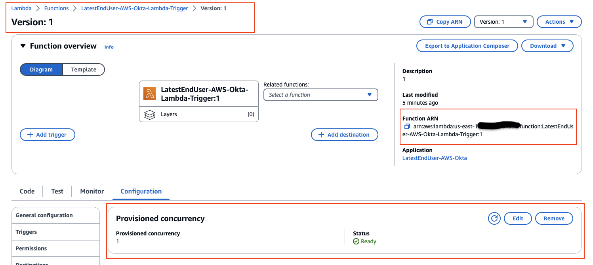
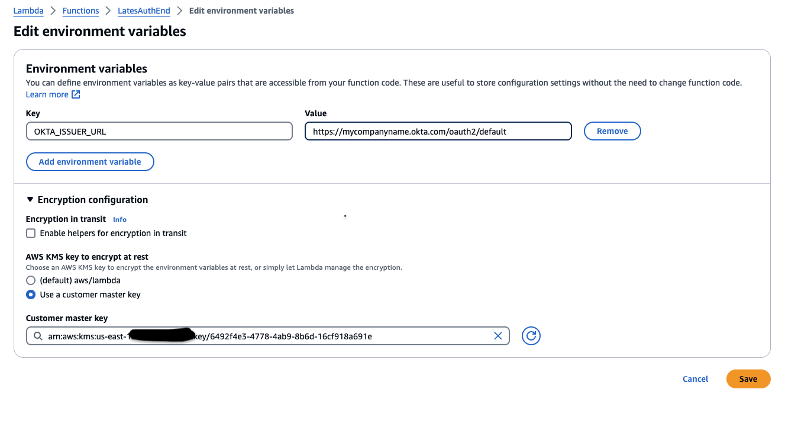
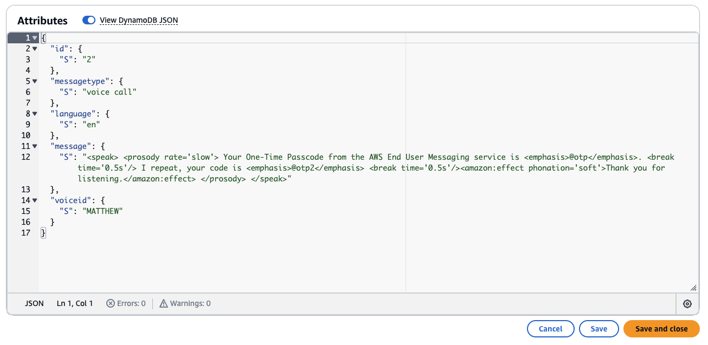

# Guidance for Okta Phone-Based Multi-Factor Authentication on AWS

## Table of Content
1. [Overview](#overview)
    - [Cost](#cost)
2. [Prerequisites](#prerequisites)
3. [Deployment Steps](#deployment-steps)
   - [Deploying AWS Resources using AWS CloudFormation](#deploying-aws-resources-using-aws-cloudformation)
   - [Upload The Lambda API Trigger Function Code](#upload-the-lambda-api-trigger-function-code)
   - [Upload the Lambda Authorizer Trigger Function Code](#upload-the-lambda-authorizer-trigger-function-code)
   - [Save Messages in DynamoDB](#save-messages-in-dynamodb)
   - [Create Inline Hook in Okta](#create-inline-hook-in-okta)
      - [Setup Steps](#setup-steps)
4. [Deployment Validation](#deployment-validation)
5. [Running the Guidance](#running-the-guidance)
6. [Next Steps](#next-steps)
7. [Clean Up](#clean-up)
8. [Notices](#notices)
9. [Author](#author)

## Overview

This Guidance demonstrates how to implement a secure and scalable one time passcode (OTP) delivery system by integrating AWS End User Messaging with Okta. The solution caters to a diverse user base by supporting multiple languages and communication methods, storing language-specific message templates in a dynamic, scalable database. When a user requests an OTP, Okta's telephony inline hook is activated, creating a request for OTP delivery through AWS. The system personalizes the message by including the OTP code and tailoring it based on the user's language preference and delivery channel, such as SMS or voice call. Additionally, the solution supports phone numbers from multiple countries through the AWS End User Messaging service, which provides coverage for over 240 countries. By leveraging this service, the OTP delivery system can seamlessly handle phone numbers from various countries, ensuring a consistent and reliable experience for users worldwide. 

  

### Cost
The following table provides a sample cost breakdown for deploying this Guidance with the default parameters in the US East (N. Virginia) Region for one month.

| AWS Service | Dimensions | Cost (USD) |
| --- | --- | --- |
| AWS Lambda | Usage: 1,000 messages Breakdown: Approximately $0 | $0 |
| AWS Lambda Authorizer | Usage: 1,000 messages Breakdown: Approximately $0 | $0 |
| Amazon API Gateway | Usage: 1,000 messages, Cache 0.5  Breakdown: Approximately $15 | $15 |
| Amazon DynamoDB | Usage: 1,000 messages Breakdown: Approximately $12 | $12 |
| AWS End User Messaging | Usage: 1,000 messages Breakdown: Approximately $0 | $0 |
| AWS WAF |  Usage: 1 ACL, 5 Rules Approximately $10 | $10 |
| Total per month | - | $37 |

## Prerequisites

1. Install Node.js 14.15.0 or later
2. Install Zip on terminal
3. Production AWS End User Messaging account
4. Dedicated phone number in AWS End User Messaging (short-code, long-code etc.)

Initially, your AWS account will be configured as a Sandbox account within AWS End User Messaging. To move into a production environment and to increase your SMS and Voice Service spend limits, please follow the detailed steps outlined in the AWS End User Messaging [User Guide Open Case](https://docs.aws.amazon.com/sms-voice/latest/userguide/sandbox.html#channels-voice-manage-sandbox). Transitioning to a production account will enable you to send messages without the sandbox restrictions.

Additionally, when preparing to send messages, you'll need to acquire a dedicated phone number. For specialized requirements like Short Codes, Toll-Free Numbers, or 10DLC Campaign Numbers, refer to the comprehensive instructions provided in the AWS End User Messaging Phone Numbers [User Guide Phone Numbers](https://docs.aws.amazon.com/sms-voice/latest/userguide/phone-numbers.html). Keep in mind that carrier considerations such as message throughput, number pooling, carrier filtering policies, compliance with carrier regulations, and delivery rates are crucial factors that can influence your choice of number type and impact the delivery rates and success of your messaging campaigns. It's essential to understand the various throughput limitations, fees, and region-specific regulations associated with different carriers, as well as the need for sender ID registration in certain regions. By taking these carrier considerations into account, you can ensure that your messaging services are both effective and compliant with all relevant guidelines and regulations.

To acquire a US long code for testing purposes, please adhere to the instructions in this guide. Ensure that you select 'Voice only' for the Messaging use case and choose 'Long code' as the originator type. This action will immediately allocate a phone number to your account, which will be restricted to voice call functionalities only. [Request Long Code](https://docs.aws.amazon.com/sms-voice/latest/userguide/phone-numbers-request.html). 

### Operating System
These deployment instructions are optimized to best work on a Mac or Linux environment. Deployment in Windows may require additional steps for setting up required libraries and CLI.

## Deployment Steps

### Deploying AWS Resources using AWS CloudFormation

To deploy the CloudFormation template from the AWS console, you can follow these steps:

1. **Clone GitHub repository**
   - Run the `git clone ${repoURL}` terminal command to download the repository

2. **Access CloudFormation Service**:
   - Open the AWS Management Console and navigate to the CloudFormation service. You can search for "CloudFormation" in the search bar at the top of the console. [CloudFormation Console](https://console.aws.amazon.com/cloudformation/).

3. **Create Stack**:
   - Click on the orange "Create stack" button.

4. **Specify Template**:
   - Choose "Upload a template file" option.
   - Click "Browse" and select the CloudFormation template file `CloudFormationDeployment.yml`
   (**Folder location:** guidance-for-okta-phone-based-multi-factor-authentication-on-aws/deployment)
   - Click "Next".

5. **Specify Stack Details**:
   - Enter a unique name for your CloudFormation stack (e.g., "test-deployment-stack").
   - Click "Next".

6. **Configure Parameters**:
   - The console will display all the parameters defined in the template (LambdaAPITriggerFunctionName, etc.).
   - Provide values for each parameter according to your requirements. Refer to the parameter descriptions in the template for guidance.
   - Click "Next".

7. **Review and Create**:
   - Review the details of your stack creation, including resources, parameters, and outputs.
   - If everything looks good, check the box next to "I acknowledge that AWS CloudFormation might create AWS resources for you. Charges may apply."
   - Click the orange "Create stack" button to initiate the deployment.

8. **Monitor Stack Status**:
   - The CloudFormation console will display the status of your stack creation. It may take a few minutes to complete depending on the resources involved.
   - You can monitor the progress and view any potential errors that might occur during deployment.

9. **Outputs**:
   - Once the stack creation is successful, the "Outputs" section will display the generated values like Lambda function ARN, and API Gateway invoke URL etc.

**Additional Notes**:
- You can access the deployed resources (Lambda function, API Gateway, etc.) from their respective service dashboards in the AWS console.

By following these steps, you have accomplished the deployment of your CloudFormation template via the AWS Management Console.
 
## Upload The Lambda API Trigger Function Code

Navigate to the `guidance-for-okta-phone-based-multi-factor-authentication-on-aws/deployment/Lambda-API-Trigger` directory. It is crucial to note that the `index.js` file within the `Lambda-API-Trigger` folder is coded to operate in the `us-east-1` AWS region. Should you intend to deploy your function in a different AWS region, you must modify the region configuration within the code. Specifically, you'll need to alter the variable `aws_region` found on line #5 of the `index.js` file to reflect your target region.

The file `originationIdentities.json` maps two-letter country codes to origination identities (phone numbers, Sender IDs, short codes, ARNs, etc.) associated with the AWS End User Messaging Service. These origination identities must be registered with your AWS Account and listed within the AWS End User Messaging Service Dashboard. The keys represent the two-letter country codes, while the values correspond to the registered origination identities. The origination identity can be a PhoneNumber, PhoneNumberId, PhoneNumberArn, SenderId, SenderIdArn, PoolId, or PoolArn. To add support for a new country, determine the two-letter country code, add a new entry with the country code as the key, and set the value to the appropriate registered origination identity.

Example for France (country code FR) with a phone number as the origination identity

"FR": "+33987654321",

Example for Germany (country code DE) with a Sender ID ARN as the origination identity

"DE": "arn:aws:sms-voice:us-east-1:123456789012:sender-id/ABCDEF/DE"

Inside the `originationIdentities.json` you will find examples, please edit this file with your origination identities for the desired countries. Once you have edited and saved the file you may proceed with **Step 1**. 

1. **Open the Lambda console** at [AWS Lambda Console](https://console.aws.amazon.com/lambda/).

2. In the **navigation pane** on the left side of the console, choose **Functions**.

3. In the list, **choose the Lambda API Trigger Function** created by CloudFormation.

4. Open a Mac/Linux terminal and navigate to the `guidance-for-okta-phone-based-multi-factor-authentication-on-aws/deployment/Lambda-API-Trigger` directory. 

   Example: `cd /Users/UserName/Desktop/guidance-for-okta-phone-based-multi-factor-authentication-on-aws/deployment/Lambda-API-Trigger`

5. Run the following terminal command to download the latest libphonenumber-js Module.

   Run command: `npm install libphonenumber-js` (node must be installed to run)

6. Zip up `node_modules`, `originationIdentities.json`, `index.js`, `package.json` and `package-lock.json` together located in `guidance-for-okta-phone-based-multi-factor-authentication-on-aws/deployment/Lambda-API-Trigger` folder. Use the following Zip command on Mac/Linux.

   Run command: `zip -r LambdaAPITrigger.zip *`

7. Go back to the Lambda Console

8. Click on the **Code** tab.

9. Click on the **Upload From** drop down and select **LambdaAPITrigger.zip** file.

10. Upload the **LambdaAPITrigger.zip** file created in step 6.

11. Once LambdaAPITrigger.zip is uploaded, verify you see the `node_modules`, `index.js`, `originationIdentities.json`, `package.json` and `package-lock.json` file inside the lambda directory. Remove any other files.

12. Click the **Deploy** button if any files were removed. 

  

**NOTE: Steps 13 - 26 are optional, Provisioned concurrency is useful for reducing cold start latencies for functions as Okta expects a 3 second or less response time.**

13. After deployment, scroll to the top of the page and click on the `Actions` tab.

14. Click on `Publish new version`.

15. (Optional) Enter a description for this version, then click "Publish".

16. Once the new version is published, go to the `Configuration` tab

17. On the left pane scroll down to the `Provisioned concurrency`.

18. In `Provisioned concurrency` section click on `edit`

19. In the box enter desried concurrency or just `1` for testing.

20. Wait for the Provisioned Concurrency to be allocated. This may take a few minutes.

21. Once allocated, `copy the Fucntion ARN`  as we will need to update the Amazon API Gateway to use the new published version Lambda ARN. 

  

22. **Open the Amazon API Gateway console** at [Amazon API Gateway](https://console.aws.amazon.com/apigateway/)

23. In the list, choose the Amazon API Gateway created by CloudFormation.

24. On the left pane click on `Resources`. Then click on the green `POST` downpdown.

25. Click on the `Integration request` tab. Then click `edit` 

26. The required fields will be pre-filled. You need to `delete` the current Lambda Function ARN in the `Lambda Function ARN` field and `paste the Lambda Function Version ARN that you copied in step 21`. Click `Save`

Remember: Enabling Provisioned Concurrency will incur additional costs as you're reserving compute capacity regardless of whether it's being used. Adjust the number of provisioned concurrent executions based on your expected load and performance requirements. As new versions are published you will need to update Amazon API Gateway to use the newest version.

By completing these steps, you have successfully deployed your Lambda Function via the AWS Lambda Console. Please ensure that you adjust the region value within the code to match your targeted AWS region if it differs from the default 'us-east-1' region.

## Upload the Lambda Authorizer Trigger Function Code

The AWS Lambda Authorizer Trigger Function is designed to secure the Amazon API gateway by leveraging OAuth 2.0 JWT tokens provided by Okta. Once deployed, this function acts as a gatekeeper, authenticating incoming requests the Amazon API gateway endpoint. It verifies JWT tokens to ensure that they are valid and have been issued by Okta. This setup is critical for maintaining secure access and preventing unauthorized use of your Amazon API gateway endpoint.

1. **Open the Lambda console** at [AWS Lambda Console](https://console.aws.amazon.com/lambda/).

2. In the **navigation pane** on the left side of the console, choose **Functions**.

3. In the list, **choose the Lambda Authorizer Function** created by CloudFormation.

4. Open a Mac/Linux terminal and navigate to the `guidance-for-okta-phone-based-multi-factor-authentication-on-aws/deployment/Lambda-Authorizer` directory. 

   Example: `cd /Users/UserName/Desktop/guidance-for-okta-phone-based-multi-factor-authentication-on-aws/deployment/Lambda-Authorizer`

5. Run the following terminal command to download the latest Okta JWT Verifier Module.

   Run command: `npm i @okta/jwt-verifier` (node must be installed to run)

6. Zip up `node_modules`, `index.js`, `package.json` and `package-lock.json` together located in `guidance-for-okta-phone-based-multi-factor-authentication-on-aws/deployment/Lambda-Authorizer` folder. Use the following Zip command on Mac/Linux.

   Run command: `zip -r Verifer.zip *`

7. Go back to the Lambda Console

8. Click on the **Code** tab.

9. Click on the **Upload From** drop down and select **Verifer.zip** file.

10. Upload the **Verifer.zip** file created in step 6.

11. Once Verifer.zip is uploaded, verify you see the `node_modules`, `index.js`, `package.json` and `package-lock.json` file inside the lambda directory. Remove any other files.

12. Click the **Deploy** button if any files were removed. 

  

12. Click on the **Configuration** tab

13. On the left pane click on **Environment variables** and click the **edit** button.

14. There will be a key variable named `OKTA_ISSUER_URL`. You will edit the **Value** for that key and replace the `$(yourOktaDomain)` with your actual Okta Domain name. The value should look like this `EX: https://mycompanyname.okta.com/oauth2/default`. A common mistake in this step is to remove `/oauth2/default`, please make sure you do not accidentally delete the ending value as the guidance will fail. Make sure your value looks like the example provided with your okta domain. 

  

15. Click **Save**

By completing these steps, you have successfully deployed your Lambda Authorizer Function via the AWS Lambda Console.

## Save Messages in DynamoDB

**Note**: For converting text to speech, AWS End User Messaging uses Amazon Polly, which offers a variety of language options. In this example, we're focusing on English and Spanish language support. If your requirements include additional languages, please see the [Amazon Polly Voice List](https://aws.amazon.com/polly/docs/voicelist/) to determine the appropriate language codes and voice IDs. To incorporate these languages into your setup, reference the format provided in the 'English-Spanish-Data.txt' file, which outlines how messages are structured in DynamoDB. Then follow these steps to store language data into DynamoDB.

Use the following steps to enter data into a DynamoDB table via the DynamoDB console. DynamoDB serves as a repository for storing message content in different languages, which is then sent to users. This guide focuses on how to store message templates in both English and Spanish for SMS and voice communications.

1. **Open the DynamoDB console** at [AWS DynamoDB Console](https://console.aws.amazon.com/dynamodb/).

2. In the navigation pane on the left side of the console, choose **Tables**.

3. In the table list, **choose the table** created by CloudFormation.

4. Select **Explore Table Items**.

5. In the Items returned view, choose **Create item**.

6. **Add data in JSON view**.

7. **Copy and Paste** the`English Voice Sample` text from the `English-Spanish-Data.txt` file.

8. Click **Create Item**.

**Sample Voice message:**

9. **Repeat steps 5 to 8** for the `Spanish Voice Sample`.

10. To add SMS message templates. In the Items returned view, choose **Create item**.

11. **Add data in JSON view**

12. **Copy and Paste** the `English SMS Sample` from the `English-Spanish-Data.txt` file.

13. Click **Create Item**.

**Sample SMS message:** 

14. **Repeat steps 10 to 13** for the `Spanish SMS Sample`.

**Database Entries:** 

Upon completing these steps, your DynamoDB table will be ready to store and manage your language message data.

## Create Inline Hook in Okta

This section provides a detailed guide on setting up and testing an OAuth 2.0 Telephony Inline Hook with Okta. You will configure your Okta environment, including creating a private key, setting up an app integration, and defining a custom scope. Once set up, you will add OAuth 2.0 authentication fields to ensure secure interactions with the Amazon API Gateway for SMS and voice communications.

### Setup Steps

1. **Create a Key:**
   - Navigate to the **Admin Console** and go to **Workflow > Key Management**.
   - Click **Create new key** and add a unique name for the key. You will reference this name when adding your Inline Hook.
   - Click **Create key**. The key is added to the table with a creation date and status.
   - In the table, click your key name.
   - Click **Copy public key**. You will need this public key in the next steps.

2. **Create an App Integration:**
   - In the Admin Console, go to **Applications > Applications**.
   - Click **Create App Integration**.
   - Select **API Services** as the Sign-in method and click **Next**.
   - Specify the app integration name, then click **Save**.
   - From the **General** tab of your app integration, click **Edit** next to **Client Credentials**.
   - In the **Client authentication** field, select **Public key / Private key**.
   - In the **Public Keys** section, click **Add key**.
   - Paste the public key that you copied earlier, and click **Done**.
   - Scroll to **General Settings** and click **Edit**
   - **Uncheck** the box for **Proof of possession**
   - Click **Save** 
   - Scroll to the top and copy the generated **Client ID** value.

3. **Add a Custom Scope:**
   - Go to **Security > API**.
   - On the **Authorization Servers** tab, select the name of the authorization server, then select **Scopes**.
   - Click **Add Scope**.
   - Enter a **Name** and **Description** for the scope. You will need the name of the scope when configuring your Inline Hook.
   - Select the checkbox **Include in public metadata**.
   - Click **Create**.

4. **Add Inline Hook with OAuth 2.0 Authentication Fields**
   - In the Admin Console, go to **Workflow > Inline Hooks**.
   - Click **Add Inline Hook** and select **Telephony**
   - Add a name for the Hook
   - Add the Amazon API Gateway URL, including the endpoint where the API is hosted (e.g., https://xxxxxxxx.execute-api.us-east-1.amazonaws.com/dev/mfa).
   - When creating your Inline Hook, in the **Authentication** section, select **OAuth 2.0**.
   - In the **Client Authentication** field, select **Use private key** from the dropdown menu.
   - Add the **Client ID** value from your app integration.
   - Select the **Key** that you created previously from the dropdown menu.
   - Add the authorization server's token URL, such as `https://${yourOktaDomain}/oauth2/default/v1/token`, and the custom scope that you created previously.
   - Click **Save**.

   **Inline Hook Configuration:**

  

## Deployment Validation

To validate the deployment, follow these steps:

1. **Verify AWS CloudFormation Stack**
   - In the AWS Management Console, navigate to the CloudFormation service.
   - Locate the stack you created for this deployment and confirm that the status is "CREATE_COMPLETE".
   - Review the stack outputs to ensure that all required resources (Lambda functions, API Gateway, DynamoDB table, etc.) have been successfully created.

2. **Verify Lambda Functions**
   - Open the AWS Lambda console and locate the two Lambda functions deployed by the CloudFormation stack:
     - **Lambda API Trigger Function**: Verify you adjust the code to reference the proper AWS region where the lambda is being launched. Also, make sure the proper environment variables are set in the Lambda Function configuration. You must have `DYNAMODB_TABLE_NAME`. Also verify the `node_modules`, `originationIdentities.json`, `index.js`, `package.json` and `package-lock.json` files/folders are inside the Lambda code source.
     - **Lambda Authorizer Trigger Function**: Verify the `node_modules`, `index.js`, `package.json` and `package-lock.json` files/folders are inside the Lambda code source.

3. **Verify the API Gateway Configuration**:
   - In the AWS Management Console, navigate to the API Gateway service.
   - Locate the API created by the CloudFormation stack and review the configuration, including the deployed stage and method.

4. **Validate the DynamoDB Table**:
   - Open the Amazon DynamoDB console and locate the table created by the CloudFormation stack.
   - Verify that the table has the expected structure and that the sample data you added earlier is present.

5. **Verify the Inline Hook:**
   - In the Okta Admin Console, navigate to the **Workflow > Inline Hooks** section.
   - Locate the Inline Hook you created for the Amazon API Gateway integration and confirm that it is listed correctly.

## Running the Guidance

1. Return to the Okta Admin console **Workflow > Inline Hooks** page and click on your Inline Hook.

2. Navigate to the **Preview** tab.

3. **Configure Test**:
   - For user profile, select a user.
   - For requestType, select **MFA Verification**.

4. **Generate and Edit Request**:
   - Click on **Generate Request**.
   - Click on **Edit**.
   - Edit `phoneNumber` with your destination phone number.
   - Edit `deliveryChannel` to `voice call` instead of SMS.
   - **Note:** For this test, the long code associated with the AWS End User Messaging account supports only voice communications. If your assigned long code or short code supports SMS, you can configure it to use SMS as needed.
   - Edit `locale` to `en` instead of EN-US. This will test a voice call using our voice english template.

5. **Submit Request**: Click `Save` and then on the `View Response` button.

   **Okta Successful Response:** 

  

6. **Interpreting Output**
Observe the Response: The Okta Console will display the response from the Amazon API Gateway in JSON format. Verify that the response includes the following:
   
   -Status Code: The response should have a status code of "Successful", indicating a successful request.

   -Provider: The response should include the Provider which is the name of the Okta inline hook.

   -Transition ID: The response should also include a transaction ID. 
   
   -Verify the Phone Call: If the test was successful, you should receive a phone call or SMS on the specified number.

By following these steps, you can validate the proper functioning of the Okta phone-based multi-factor authentication solution on AWS, ensuring that the OTP delivery process is working as expected.

## Next Steps

To activate the Okta Inline Hook and enable it to handle login requests, follow these next steps:

1. **Update an Okta Authentication Policy**: Update a preset or new authentication policy by adding a new rule. These MFA capabilities can be applied to MFA use cases where SMS or voice-based MFA is needed to log into Okta or various Okta-integrated applications such as AWS, Salesforce, and more. To enable this, you need to activate the `Phone` authenticator under the `Authenticators` section in Okta, which will allow users to enroll their mobile phone numbers for SMS or voice-based authentication.

2. **Expand Language Support**: The current implementation focuses on English and Spanish language support for SMS and voice communications. Consider adding support for additional languages by adding message templates in the DynamoDB table. Reference the [Amazon Polly Voice List](https://aws.amazon.com/polly/docs/voicelist/) to determine the appropriate language codes and voice IDs for your requirements.

3. **Add Additional Countries to originationIdentities.json**: As your user base expands to different countries, update the originationIdentities.json file by adding new entries for the respective country codes. Ensure that the origination identities (phone numbers, Sender IDs, short codes, ARNs, etc.) are registered with your AWS Account and listed within the AWS End User Messaging Service Dashboard. 

4. **Implement Dynamic Message Personalization**: You can dynamically personalize the messages templates. This can be done by editing or adding new message templates in the DynamoDB table.

5. **Enhance Security Measures**: Consider adding additional managed or custom AWS WAF rules based on your specific security requirements and threat landscape. 

## Clean Up

Follow these steps to properly remove the resources and ensure that your AWS account and Okta configuration do not continue to be charged.

1. **Delete AWS CloudFormation Stacks**: Navigate to the AWS CloudFormation console and delete the stack you have deployed. This action removes all resources associated with those stacks, including AWS Lambda functions, Amazon API Gateways, Amazon DynamoDB tables, and any other related services.

2. **Revoke Okta Inline Hooks and API Tokens**: In the Okta Admin Console, remove any Inline Hooks you have set up and delete any API tokens or sessions created for this integration to ensure that no unwanted operations remain active.

By following these clean-up steps, you ensure that all temporary configurations and resources are properly decommissioned.

## Notices

**Legal Disclaimer:**
*Customers are responsible for making their own independent assessment of the information in this Guidance. This Guidance: (a) is for informational purposes only, (b) represents AWS current product offerings and practices, which are subject to change without notice, and (c) does not create any commitments or assurances from AWS and its affiliates, suppliers or licensors. AWS products or services are provided “as is” without warranties, representations, or conditions of any kind, whether express or implied. AWS responsibilities and liabilities to its customers are controlled by AWS agreements, and this Guidance is not part of, nor does it modify, any agreement between AWS and its customers.*

## Author
[Jose Alvarez](https://www.linkedin.com/in/jose-alvarez-3a71a2107/)
